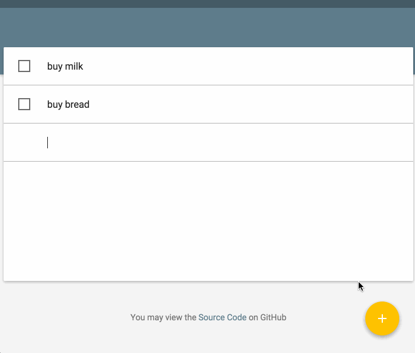

#React-Todo
[](https://travis-ci.org/fresk-nc/react-todo)
[](http://stackshare.io/fresk-nc/react-todo)

Project is designed to try React and Redux in action.

[http://fresk-react-todo.herokuapp.com/](http://fresk-react-todo.herokuapp.com/)



## Run

Install the MongoDB, if you have not done it.
Run this two commands in different console tabs.

```
$ npm run watch
$ npm run daemon
```
